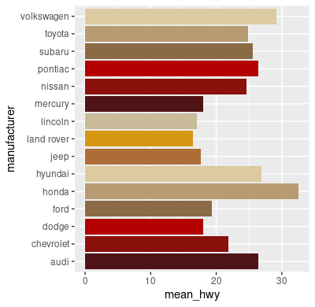
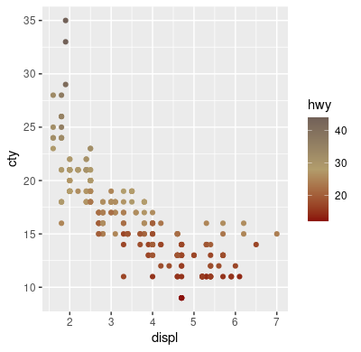

# BC Color Palettes for `R`

See [BC's web style guide](https://www.bc.edu/bc-web/styles/bc-web-style-guide/color.html) for this and other specifications.

## Usage
```R
bc_color_palette <- bc_palette(name, n, type = c("discrete", "continuous"))
```

Param `name` - One of `"main_brand"`, `"primary"`, `"secondary"` or `"news_channel"`. See [Palettes](#palettes) for specifications.

Param `n` - Number of colors to return. If missing, defaults to the length of the entire palette.

Param `type` - Using `"discrete"` will return the number of colors provided by `n`. `bc_palette()` will recycle through the palette if `n` is less than the number of colors in the selected palette. Using `"continuous"` will create a color ramp with the number of colors provided by `n`.

## Examples
```R
library(ggplot2)
library(dplyr)
source("bc_palette.R")

mpg %>%
  group_by(manufacturer) %>%
  summarize(mean_hwy = mean(hwy)) %>%
  ggplot(aes(x = manufacturer, y = mean_hwy, fill = manufacturer)) + 
  theme(legend.position = "none") + 
  coord_flip() +
  geom_col() +
  scale_fill_manual(
    values = bc_palette(
      name   = "primary",
      n      = nlevels(factor(mpg$manufacturer)), 
      type   = "discrete"
    )
  )
```


```R
library(ggplot2)
library(dplyr)
source("bc_palette.R")

mpg %>%
  ggplot(aes(x = displ, y = cty, color = hwy)) + 
  geom_point() + 
  scale_colour_gradientn(colors = bc_palette("main_brand", type = "continuous"))
```


## Palettes
### Main Branding

Color                                                            | Hex       | RGB           
---                                                              | ---       | ---            
  | `#8a100b` | `138, 16, 11`  
  | `#b29d6c` | `178, 157, 108` 
  | `#726158` | `114, 97, 88`  


### Primary

Color                                                            | Hex       | RGB
---                                                              | ---       | ---    
  | `#501315` | `86, 6, 15`    
  | `#8a100b` | `138, 16, 11`   
  | `#b30000` | `179, 0, 0`    
  | `#8a6b46` | `85, 85, 85`   
  | `#b99b73` | `185, 155, 115` 
  | `#dccaa0` | `220, 202, 160`
  | `#ac6d37` | `172, 109, 55` 
  | `#d79713` | `215, 151, 19` 
  | `#c9ba99` | `201, 186, 153`


### Secondary

Color                                                            | Hex       | RGB    
---                                                              | ---       | ---         
  | `#8a100b` | `138, 16, 11`  
  | `#b29d6c` | `178, 157, 108`
  | `#726158` | `114, 97, 88`  
  | `#b7b3a5` | `183, 179, 165` 
  | `#c5cfac` | `197, 207, 172` 
  | `#7fa7a4` | `127, 167, 164` 
  | `#b2c0b9` | `178, 192, 185` 
  | `#799fa4` | `121, 159, 164` 
  | `#7a787c` | `122, 120, 124` 
  | `#929b90` | `146, 155, 144` 
  | `#d5cfb5` | `213, 207, 181`


### News

Color                                                             |  Type                   | Hex       | RGB        
---                                                               | ---                     | ---       | --- 
   | Blue                    | `#6296a8` | `98, 150, 168`   
   | Athletics               | `#c23148` | `194, 49, 72`  
   | Campus Community        | `#ff9673` | `255, 150, 115`   
   | Faith & Religion        | `#9fab78` | `159, 171, 120`  
   | Humanities              | `#dfad58` | `223, 173, 88` 
   | Nation, World & Society | `#d48554` | `212, 133, 843` 
   | Science, Tech & Health  | `#0873ae` | `8, 115, 174`  
   | BC Events               | `#938479` | `147, 132, 121` 
